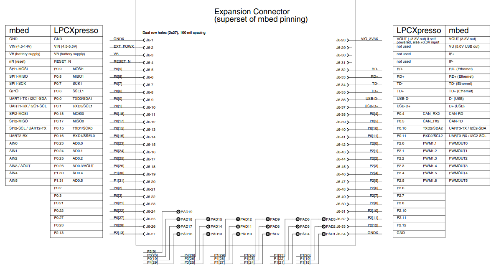
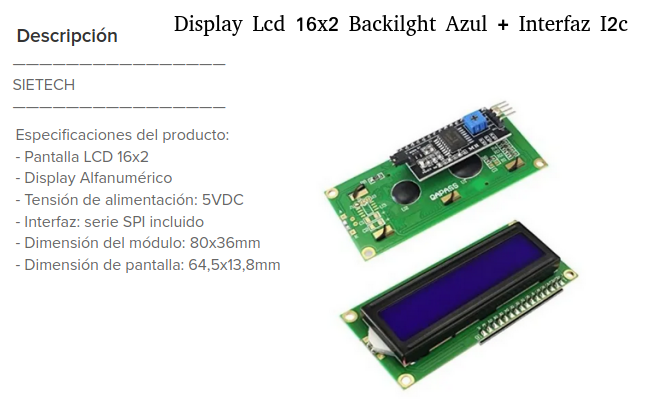
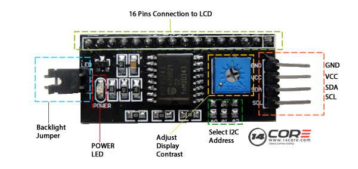
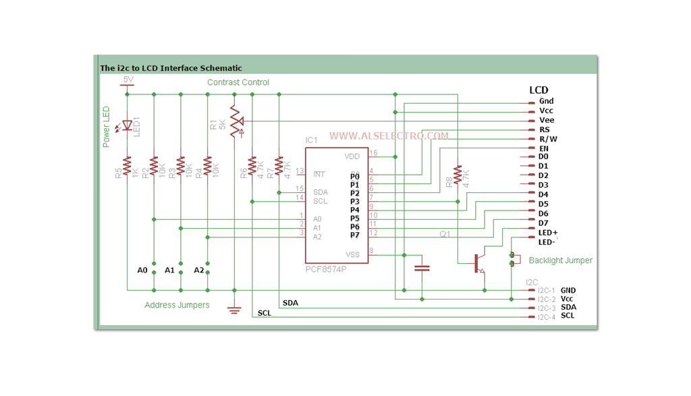

#   lcd_i2c_lpc1769_example
Proyecto ejemplo para controlar LCD 02x16 con interfaz I2C (o IIC) con el micro controlador LPCXpresso lpc1769.

- IDE: [MCUXpresso IDE](https://www.nxp.com/design/software/development-software/mcuxpresso-software-and-tools-/mcuxpresso-integrated-development-environment-ide:MCUXpresso-IDE).
- Lenguaje: C.
- Microcontrolador: [LPCXpresso lpc1769 rev C](https://www.embeddedartists.com/products/lpc1769-lpcxpresso/).
- Libreria [LPC Open](https://www.nxp.com/design/microcontrollers-developer-resources/lpcopen-libraries-and-examples:LPC-OPEN-LIBRARIES).
- Adaptador I2C Backpack PCF8574
- Display [LCD 1602](https://www.amazon.es/ARCELI-Serial-Pantalla-retroiluminaci%C3%B3n-Arduino/dp/B07J2Q9LB7/ref=sr_1_6?dchild=1&keywords=Arduino+16x2+Lcd&qid=1615514631&sr=8-6)
- Adaptador I2C Backpack PCF8574

---
## LPCXpresso LPC1769
 

## Display LCD

## I2C Backpack

---
Autor: @ealegremendoza

E-mail: ealegremendoza@gmail.com
